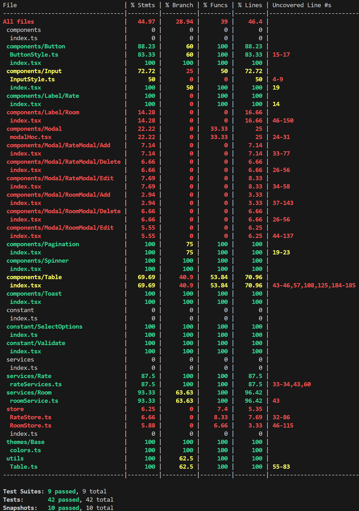

# Hotel Management
## OVERVIEW
- This document provides requirements, technical stack, and estimation for React Practice.
## TECHNICAL STACK
- HTML5/CSS3
- Chakra UI 
- Strapi API
- Typescript 
- React 
- StoryBook 
- Jest 
- Zustand 
- React Query
- React hook form 
- React Testing Library 
- React Router
## DESIGN
- Design: [Figma](https://www.figma.com/design/9NiorG43Evo05PdPk5b1Iz/Hotel-Management?node-id=239-1603&node-type=frame&t=TURjUPTnztPfQEOI-0)
## REQUIREMENTS
- My Requirements: [My Requirements](https://docs.google.com/document/d/1dHUcUkzdZqi0dNWQiJpNDUrF9ElxhZk6O6xYXC4OkFQ/edit?tab=t.0)
## GETTING STARTED
- Step by step to run the web site and storybook in your local

1. Clone the project repository
```
git clone git@gitlab.asoft-python.com:viet.duong/react-training.git
```
2.  Install project dependencies
- Move to the cloned repository folder
```
cd feature/hotel-management
```
- Install dependencies
```
pnpm install
```
3.  Set up environment variables
```
- Create a .env.local file in the root directory
- Contact the author to get the value of environment variables (please follow .env.example to get the key)
```
4.  Running the page
```
- Open a new terminal
- Run the page
- pnpm dev
- The page will run on http://localhost:3000 by default. You can access it using your browser.
```
5.  Running the storybook
```
- Open a new terminal
- Run the storybook
- pnpm storybook
- The storybook will run on http://localhost:6006 by default. You can access it using your browser.
```
6. Coverage Report

